# Supply chain data model

## Files
- UML diagram based on the requirements: [diagram.svg](diagram.svg) generated from [diagram.md](diagram.md)
- Custom vocabulary with the missing classes and properties not found in existing vocabularies: 
[supply-chain-vocab.ttl](supply-chain-vocab.ttl)
- Shapes explaining how the different classes and properties are used together: [shapes.ttl](shapes.ttl)

## Documentation

1. Navigate to `docs`.
2. Install dependencies via `npm i`.
3. Run Walder via `npm run debug`.
4. Navigate to <http://localhost:3000/vocab> or <http://localhost:3000/shapes>.

## Method
We created the data model as follows:

1. We inspected the requirements, previously gathered from the partners, and
   visualized the possible classes and properties in a diagram that can be found in [diagram.svg](diagram.svg).
2. We looked at existing vocabularies, especially within the supply chain management,
   that have the classes and properties that we acquired via the requirements.
   Grubnic and Fan[^1] highlighted the gaps in existing vocabularies targeting supply chain management,
   such as the granularity is only at the strategic level and a restricted view on a supply chain.
   The [Supply Chain Reference Ontology](https://github.com/InfoneerTXST/IOF-SupplyChain-WG)[^scro] (SCRO)
   takes these gaps into account,
   while building on top of the [core ontology](https://www.industrialontologies.org/top-down-wg/) 
   by the [Industrial Ontology Foundry](http://www.industrialontologies.org/) (IOF Core).
   We were able to reuse some of SCRO's and IOF Core's classes,
   but we also had to look at vocabularies outside the supply chain management domain.
   [Schema.org](https://schema.org/), and [FRAPO](http://purl.org/cerif/frapo/) are vocabularies that we could reuse and
   that complement SCRO.
   After taking these three vocabularies into account, we still did not have all needed classes and properties.
3. We created a custom vocabulary, focussed on supply chain management,
   with the missing classes and properties.
   See [supply-chain-vocab.ttl](supply-chain-vocab.ttl) for details.
4. Based on the requirements and the vocabularies we created SHACL shapes that state
   how the classes and properties should be used together, covering the different use case scenarios.
   See [shapes.ttl](shapes.ttl) for details.

## Results
On a high level, we provide a model combining vocabularies and SHACL shapes to description the following modules:

### Agents
There are three agents defined: a Vendor, a Supplier, and a Customer.

### Supply chain
The supply chain consists of Locations, and connections between those locations: LocationToLocation.
Each Location serves possible Customers and possible Suppliers, and has an extensible list of options (InventoryHoldingCosts being one of them).
Each LocationToLocation has a set of replenishmentMethods.

### Item
An Item is within a Vendor’s portfolio. An Item’s Quotation consists of its lead time, distance, and quantity.
An Item can have a ML model attached, either a forecast model depending on the Customer, or a prediction model depending on the Supplier.

### Order
When a Customer places an Order on an Item, OrderItem metadata is retained, specifically concerning the quantity, and potential order Feedback, i.e., actually delivered quantity, and actual delivery lead time.

[^1]: [Supply chain ontology: Review, analysis and synthesis](https://www.sciencedirect.com/science/article/abs/pii/S0166361510000552)
[^scro]: [Modeling A Supply Chain Reference Ontolgoy Based on a Top-Level Ontology](https://tsapps.nist.gov/publication/get_pdf.cfm?pub_id=928051)