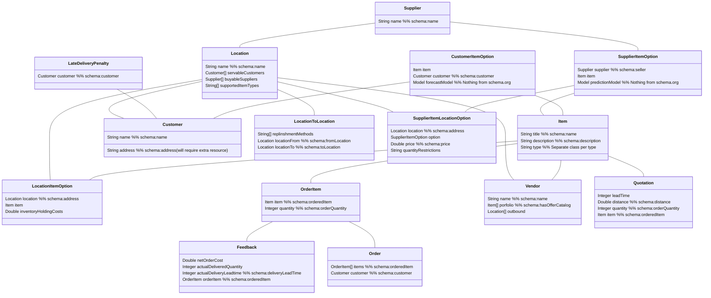

```mermaid
classDiagram
  direction BT

  %% schema:Product
  class Item {
    String title %% schema:name
    String description %% schema:description
    String type %% Separate class per type
  }

  Item -- CustomerItemOption
  Item -- SupplierItemOption

  %% io:Customer and (schema:Person or schema:Organization)
  class Customer {
    String name %% schema:name
    String address %% schema:address (will require extra resource)
  }

  Customer -- CustomerItemOption
  Customer -- LateDeliveryPenalty
  Customer -- Location

  %% frapo:Supplier and schema:Organization
  class Supplier {
    String name %% schema:name
  }

  %% schema:Place
  class Location {
    String name %% schema:name
    Customer[] servableCustomers
    Supplier[] buyableSuppliers
    String[] supportedItemTypes
  }

  Location -- Supplier

  class CustomerItemOption {
    Item item
    Customer customer %% schema:customer
    Model forecastModel %% Nothing from schema.org
  }

  %% schema:Offer
  class SupplierItemOption {
    Supplier supplier %% schema:seller
    Item item 
    Model predictionModel %% Nothing from schema.org
  }

  SupplierItemOption -- Supplier

  class LateDeliveryPenalty {
    Customer customer %% schema:customer
  }

  class LocationToLocation {
    String[] replinshmentMethods
    Location locationFrom %% schema:fromLocation
    Location locationTo %% schema:toLocation
  }

  LocationToLocation -- Location

  class SupplierItemLocationOption {
    Location location %% schema:address
    SupplierItemOption option
    Double price %% schema:price
    String quantityRestrictions
  }

  SupplierItemLocationOption -- SupplierItemOption
  SupplierItemLocationOption -- Location

  class LocationItemOption {
    Location location %% schema:address
    Item item
    Double inventoryHoldingCosts
  }

  LocationItemOption -- Item
  LocationItemOption -- Location

  %% schema:Order
  class Order {
    OrderItem[] items %% schema:orderedItem
    Customer customer %% schema:customer
  }

  Order -- OrderItem

  %% schema:OrderItem
  class OrderItem {
    Item item %% schema:orderedItem
    Integer quantity %% schema:orderQuantity
  }

  OrderItem -- Item

  %% frapo:Vendor
  class Vendor {
    String name %% schema:name
    Item[] porfolio %% schema:hasOfferCatalog
    Location[] outbound
  }

  Vendor -- Item
  Vendor -- Location

  %% frapo:Quotation
  class Quotation {
    Integer leadTime
    Double distance %% schema:distance 
    Integer quantity %% schema:orderQuantity
    Item item %% schema:orderedItem
  }

  Quotation -- Item

  %% schema:ReceiveAction
  class Feedback {
    Double netOrderCost
    Integer actualDeliveredQuantity 
    Integer actualDeliveryLeadtime %% schema:deliveryLeadTime
    OrderItem orderItem %% schema:orderedItem
  }

  Feedback -- OrderItem
```