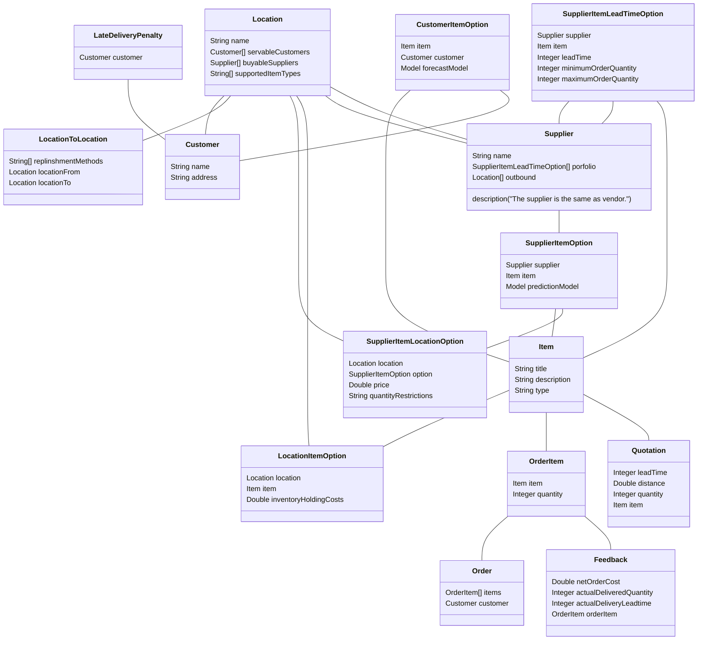

```mermaid
classDiagram
  direction BT

  class Item {
    String title
    String description
    String type
  }

  Item -- CustomerItemOption
  Item -- SupplierItemOption

  class Customer {
    String name
    String address
  }

  Customer -- CustomerItemOption
  Customer -- LateDeliveryPenalty
  Customer -- Location

  class Supplier {
    String name
    SupplierItemLeadTimeOption[] porfolio
    Location[] outbound
    description("The supplier is the same as vendor.")
  }

  class Location {
    String name
    Customer[] servableCustomers
    Supplier[] buyableSuppliers
    String[] supportedItemTypes
  }

  Location -- Supplier

  class CustomerItemOption {
    Item item
    Customer customer
    Model forecastModel
  }

  class SupplierItemOption {
    Supplier supplier
    Item item 
    Model predictionModel
  }

  SupplierItemOption -- Supplier

  class LateDeliveryPenalty {
    Customer customer
  }

  class LocationToLocation {
    String[] replinshmentMethods
    Location locationFrom
    Location locationTo
  }

  LocationToLocation -- Location

  class SupplierItemLocationOption {
    Location location
    SupplierItemOption option
    Double price
    String quantityRestrictions
  }

  SupplierItemLocationOption -- SupplierItemOption
  SupplierItemLocationOption -- Location

  class LocationItemOption {
    Location location
    Item item
    Double inventoryHoldingCosts
  }

  LocationItemOption -- Item
  LocationItemOption -- Location

  class Order {
    OrderItem[] items
    Customer customer
  }

  Order -- OrderItem

  class OrderItem {
    Item item
    Integer quantity
  }

  OrderItem -- Item
  
  Supplier -- Location
  Supplier -- SupplierItemLeadTimeOption
  
  class SupplierItemLeadTimeOption {
    Supplier supplier
    Item item
    Integer leadTime
    Integer minimumOrderQuantity
    Integer maximumOrderQuantity
  }
  
  SupplierItemLeadTimeOption -- Supplier
  SupplierItemLeadTimeOption -- Item

  class Quotation {
    Integer leadTime
    Double distance
    Integer quantity
    Item item
  }

  Quotation -- Item

  class Feedback {
    Double netOrderCost
    Integer actualDeliveredQuantity 
    Integer actualDeliveryLeadtime
    OrderItem orderItem
  }

  Feedback -- OrderItem
```